    

<h3 align="center">👨‍💼 About me.</h3>

    

    🌟 Passionate about learning and continuous improvement through hands-on experience.
     
    🎯 2026 Goal: Build impactful projects and expand my portfolio.

    <h3>📄 CV.</h3>
    

        
    

    <h3>💼 Portfolio.</h3>
    

        
    

<h3 align="center">🚀 Tech Stack.</h3>

    <table>
        <tr>
            <td align="center" width="50%">
                <h3>💻 Programming Languages.</h3>
                

                    
                    
                    
                    
                    
                

            </td>
            <td align="center" width="50%">
                <h3>🌐 Web Languages & Technologies.</h3>
                

                    
                    
                    
                    
                

            </td>
        </tr>
    </table>

<h3 align="center">🗄️ Databases.</h3>

    
    
    
    

<h3 align="center">🖥️ Cloud/DevOps & Frameworks.</h3>

    
    
     
    
    
    
    
    

<h3 align="center">🛠️ Tools.</h3>

    
    
    
    
    
    

<h3 align="center">🐧 Operating Systems & Virtualization.</h3>

    
    
    

<h3 align="center">💼 Proyectos destacados.</h3>

<ul>
    <li>
        <h4>Punto de Venta (POS) - Multiservicios Ases y Reyes</h4>
        
<strong>Descripción:</strong> Sistema web integral y full-stack diseñado bajo una arquitectura completamente
            desacoplada para la automatización de flujos de venta, control logístico de inventarios y administración de
            personal. El ecosistema separa limpiamente las responsabilidades mediante una API robusta orientada a
            objetos y una interfaz de usuario fluida, reactiva y de alto rendimiento.

        

            <strong>Tecnologías usadas:</strong> 
            🔹 <em>Frontend:</em> <code>React 19</code>, <code>TypeScript</code>, <code>Tailwind CSS</code>,
            <code>Vite</code>, <code>React Router DOM v7</code>, <code>Axios</code>. 
            🔹 <em>Backend & DB:</em> <code>Node.js</code>, <code>Express</code>, <code>TypeScript</code>,
            <code>TypeORM</code>, <code>PostgreSQL</code>, <code>Docker</code>, <code>Docker Compose</code>.
        

        
<strong>Funcionalidades principales:</strong>

        <ul>
            <li>Estructura modular basada en el patrón <strong>Controlador-Servicio</strong> para la gestión avanzada
                (CRUD) de productos, categorías y empleados.</li>
            <li>Módulo de autenticación segura mediante tokens <strong>JWT</strong>.</li>
            <li>Sistema de <strong>bitácora y auditoría</strong> de acciones.</li>
            <li>Automatización en base de datos mediante <strong>triggers, procedimientos almacenados y vistas
                    nativas</strong> en PostgreSQL.</li>
            <li>Carga masiva y lectura de reportes en <strong>Excel (xlsx)</strong> y notificaciones con
                <strong>Nodemailer</strong>.</li>
            <li>Vista pública responsiva (<code>/store</code>) optimizada para la interacción del cliente final.</li>
        </ul>
    </li>
      
    <li>
        <h4><a href="https://texastrailerscrweb.web.app/" target="_blank">Texas Trailers CR - Digital Ecosystem</a></h4>
        
<strong>Descripción:</strong> Solución digital integral e híbrida (B2C y B2B) para la modernización operativa
            de una empresa de importación y venta de remolques en Costa Rica. Centraliza el inventario físico y los
            canales digitales mediante una arquitectura desacoplada basada en el patrón BaaS (Backend-as-a-Service),
            eliminando la inconsistencia de stock entre los patios de venta y la web.

        

            <strong>Tecnologías usadas:</strong> 
            🔹 <em>Web (Cliente):</em> <code>React 18</code>, <code>TypeScript</code>, <code>Tailwind CSS</code>,
            <code>Vite</code>, <code>React Router DOM v6</code>. 
            🔹 <em>Infraestructura Cloud:</em> <code>Firebase</code> (Firestore, Auth, Storage, Hosting). 
            🔹 <em>Móvil (Staff):</em> <code>Android Nativo</code>, <code>Kotlin</code>.
        

        
<strong>Funcionalidades principales:</strong>

        <ul>
            <li>Catálogo público web de alto rendimiento con sistemas de <strong>filtrado avanzado</strong> para
                clientes finales.</li>
            <li>Sincronización e integración NoSQL en <strong>tiempo real</strong> para reflejar cambios de stock
                instantáneamente.</li>
            <li>Panel administrativo móvil nativo en <strong>Kotlin</strong> para la actualización de precios y carga
                directa de fotografías desde el muelle de carga.</li>
            <li>Autenticación segura de usuarios y almacenamiento estructurado de archivos multimedia en la nube.</li>
        </ul>
    </li>
      
    <li>
        <h4><a href="https://kalova-898bf.web.app/" target="_blank">Kalova — Ecosistema Digital y Plataforma Web
                Serverless</a></h4>
        
<strong>Descripción:</strong> Plataforma web híbrida a la medida diseñada para una marca de arte mural y
            productos decorativos. El sistema unifica de extremo a extremo un catálogo digital público enfocado en la
            conversión, un motor inteligente de cotización multi-step y un backoffice administrativo robusto para la
            gestión operativa y comercial del negocio bajo una arquitectura completamente serverless.

        

            <strong>Tecnologías usadas:</strong> 
            🔹 <code>React 19</code>, <code>Vite</code>, <code>Tailwind CSS</code>, <code>React Router DOM v7</code>,
            <code>Firebase</code> (Firestore, Auth, Storage, Hosting, Cloud Functions).
        

        
<strong>Funcionalidades principales:</strong>

        <ul>
            <li>Catálogo dinámico público con showcase de video en <strong>carrusel 3D Coverflow</strong> y galerías en
                <strong>Bento Grid</strong>.</li>
            <li>Asistente inteligente de cotización (<strong>Wizard modular paso a paso</strong>) con validación
                estricta de datos y carga optimizada de imágenes.</li>
            <li>Panel de control administrativo protegido mediante roles de seguridad (<strong>RBAC</strong>) con reglas
                perimetrales en Firestore.</li>
            <li>Módulo CRUD completo para la administración autónoma de inventarios, combos y contenidos (<strong>CMS
                    ligero</strong>).</li>
            <li>Automatización vía <strong>Cloud Functions</strong> para el procesamiento de imágenes (thumbnails) y
                correos transaccionales.</li>
            <li>Integraciones fluidas con plantillas dinámicas para el seguimiento comercial vía
                <strong>WhatsApp</strong>.</li>
        </ul>
    </li>
</ul>

<h3 align="center">📊 GitHub Contributions</h3>

    
      
    
      
    

 

<h3 align="center">🐍 Representation.</h3>

    

<i>Decorative visual representation of my GitHub activity over the past year.</i>

 

<h3 align="center">📬 Contact and social media.</h3>

     &nbsp;&nbsp;
     &nbsp;&nbsp;
     &nbsp;&nbsp;

    

